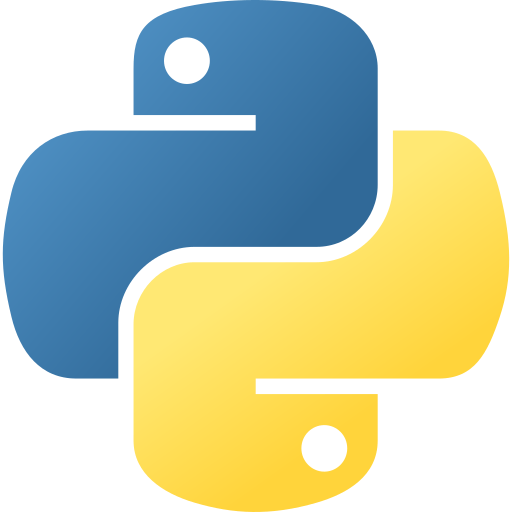
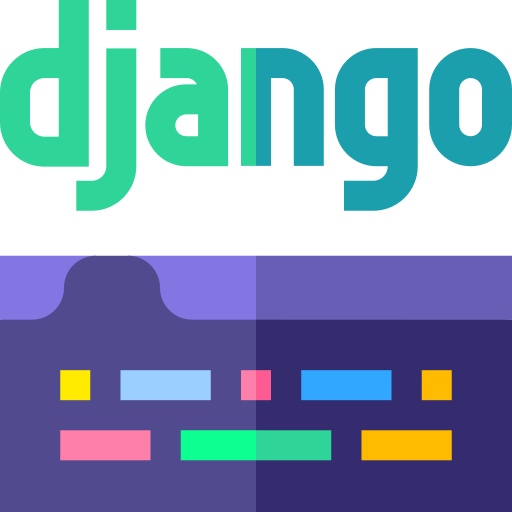
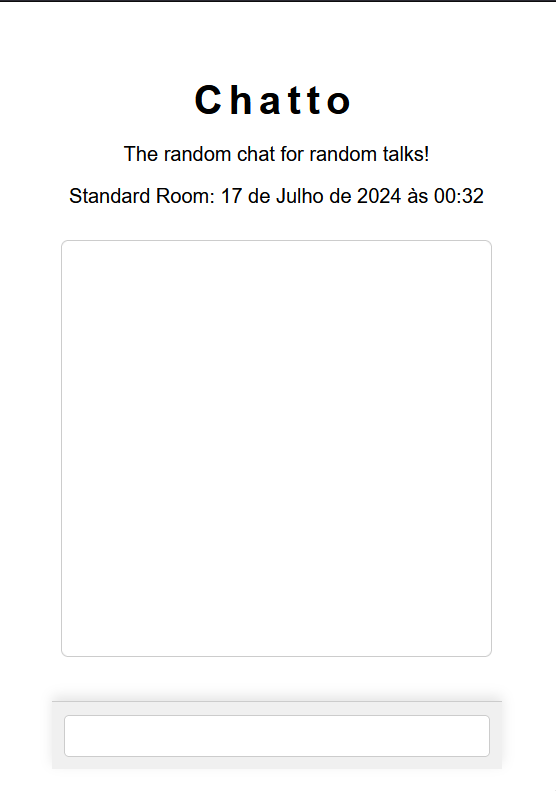

<div align="center" >
    
    <br>
    <big><p><strong>Chatto</strong></p></big>
    <div>
        
        
        
    </div>
</div>
<hr>
A chat made to exchange realtime messages, using django, and websockets to create a realtime communication via http.
<br>
<br>
<div align="center" >
    
</div>

### Tools 🛠️
- Python
- Django
- Channels
- Daphne

### Contribuing 🫂
To contribuit you gotta create a project fork, then after do for your modifications, and send me a pull request.

### How to run?
```bash 
# clone the project repository
git clone https://github.com/angelo-francisco/Chatto.git

# install the dependencies
pip install -r requirements.txt

# run, and be happy 😁
cd src
python manage.py runserver
```
### LICENSE 🔑
Project license [Here](https://opensource.org/license/mit)
<hr>
By Ângelo Francisco🖖